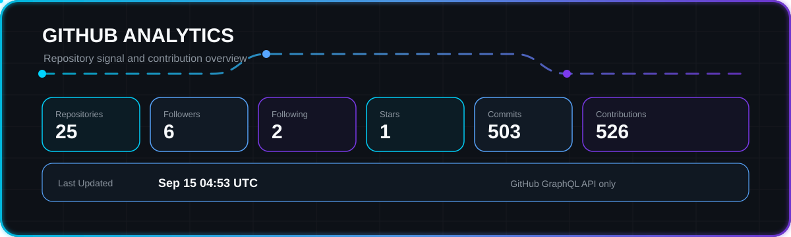
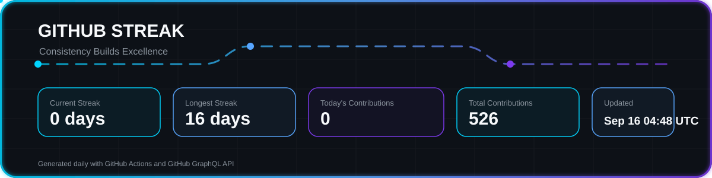

  

  

<h1 align="center">Welcome to My GitHub</h1>

<h3 align="center">
Aspiring Data Engineer | Building scalable data solutions with SQL, Python, Azure and Big Data
</h3>

  <em>Learning today. Building tomorrow.</em>

  

## About Me

I'm **Onkar Jadhav**, an aspiring **Data Engineer** focused on building a strong foundation in **SQL, Linux, Big Data, and Microsoft Azure**.

I enjoy learning new technologies, solving data-related problems, and building practical projects that reflect real-world data engineering workflows.

My goal is to create production-ready data engineering solutions and keep improving through hands-on learning.

  

## Tech Stack

  

  
  
  
  
  
  
  
  
  
  
  
  
  
  
  
  
  

  

## Featured Projects

<h3 align="center">Coming Soon</h3>

Production-ready Data Engineering projects are under development.

  

## GitHub Analytics

  

  

## GitHub Streak

  

  

## Contribution Snake

  <picture>
    <source media="(prefers-color-scheme: dark)" srcset="https://raw.githubusercontent.com/onkar0629/onkar0629/output/github-contribution-grid-snake-dark.svg">
    <source media="(prefers-color-scheme: light)" srcset="https://raw.githubusercontent.com/onkar0629/onkar0629/output/github-contribution-grid-snake.svg">
    
  </picture>

  

## Connect With Me

  

## Favorite Quote

<h3 align="center">Future Data Engineer in Progress</h3>

  <em>"Learning today. Building tomorrow."</em>

  

## Footer

  

