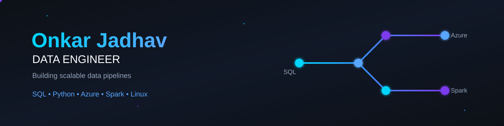

  

---
<h1 align="center">👋 Welcome to My GitHub</h1>

<h3 align="center">
Aspiring Data Engineer | Building scalable data solutions with SQL, Python, Azure & Big Data
</h3>

  <em>Learning today. Building tomorrow.</em>

---

## 🚀 About Me

I'm **Onkar Jadhav**, an aspiring **Data Engineer** focused on building a strong foundation in **SQL, Linux, Big Data, and Microsoft Azure**.

I enjoy learning new technologies, solving data-related problems, and building practical projects that reflect real-world data engineering workflows.

My goal is to create production-ready data engineering solutions and continuously grow through hands-on learning.

---

## 🛠️ Tech Stack

---

## 🏗️ Featured Projects

| Project                            | Description                                   | Stack            |
| ---------------------------------- | --------------------------------------------- | ---------------- |
| 🐧 Linux Command Encyclopedia      | Linux commands, scripts & interview questions | Linux, Bash      |
| 🐘 Hadoop Learning Journey         | Hadoop concepts and practical implementations | Hadoop, HDFS     |
| 🐝 Hive Practice Repository        | HiveQL, Partitioning, Bucketing               | Hive             |

---

## 🐍 Contribution Snake

<picture>

<source
media="(prefers-color-scheme: dark)"
srcset="https://raw.githubusercontent.com/onkar0629/onkar0629/output/github-contribution-grid-snake-dark.svg">

<source
media="(prefers-color-scheme: light)"
srcset="https://raw.githubusercontent.com/onkar0629/onkar0629/output/github-contribution-grid-snake.svg">

</picture>

---

## 📊 GitHub Analytics

  

---

## 🌐 Connect With Me

---

### ⚡ Future Data Engineer in Progress ⚡

 

### Made with ❤️ by Onkar Jadhav

